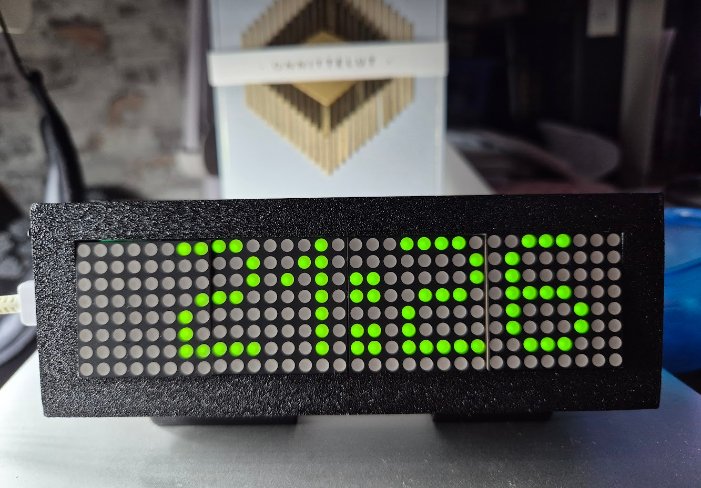

# LED Clock with MCP controls

An ESP32-based LED matrix clock, built around a ESP32C3 Super Mini module, a DS3231 RTC, and a bank of
environmental sensors sitting on a shared I2C bus. Time is kept on the DS3231 and periodically
disciplined against NTP over WiFi; the current time is shown on a 4x8x8 MAX7219 LED matrix display.
The whole thing also exposes an MCP (Model Context Protocol) HTTP endpoint so an LLM agent can read
the sensors and RTC, and adjust the NTP config and display brightness, over the network.



## Features

- **HH:MM display** on a 4-module MAX7219 LED matrix (via MD_Parola/MD_MAX72xx), driven by the
  DS3231 RTC, with a scroll animation on each digit change.
- **WiFi provisioning** via WiFiManager: on first boot (or whenever no known network is in range) the
  device serves a `led-clock` captive-portal AP so you can enter WiFi credentials, the NTP server
  hostname, and the UTC offset. Once connected it also answers to `led-clock.local` over mDNS.
- **NTP time discipline**: the DS3231 is periodically corrected against the configured NTP server, so
  it stays the single source of truth for the display while NTP just corrects its drift.
- **Environmental sensors** on the shared I2C bus, each independently detected at boot:
  - DS3231 — RTC + on-chip temperature
  - AHT20 — temperature / humidity
  - BMP280 or BME280 — pressure / temperature (BME280 also humidity)
  - SGP30 — eCO2 / TVOC (needs a multi-hour warm-up for accurate readings)
  - AS3935 (WCMCU-3935) — lightning strike detection, with distance/energy estimates
- **MCP server** at `http://led-clock.local:8080/mcp` (unauthenticated JSON-RPC 2.0 over HTTP) exposing
  tools to read live sensor data and the RTC, and to get/set the NTP config and display brightness.

## Hardware

- ESP32-C3 or ESP32-S3 board (tested on ESP32-C3 Super Mini)
- DS3231 RTC module
- AHT20 temperature/humidity sensor
- BMP280 or BME280 pressure sensor
- SGP30 eCO2/TVOC gas sensor
- WCMCU-3935 (AS3935) lightning sensor
- 4x MAX7219 8x8 LED matrix modules, chained

### Wiring

Shared I2C bus (DS3231, AHT20, BMx280, SGP30, AS3935):

| Signal    | ESP32-C3 pin |
|-----------|--------------|
| SDA       | IO8          |
| SCL       | IO9          |
| AS3935 IRQ| IO5          |

MAX7219 LED matrix (bit-banged SPI, independent of the I2C bus):

| Signal    | Pin    |
|-----------|--------|
| DIN       | GPIO6  |
| CLK       | GPIO10 |
| CS/LOAD   | GPIO7  |

The AS3935 and BMx280 I2C addresses depend on how each board straps its address pins, so the sketch
probes the common candidates at boot and, for the BMx280, reads back the chip ID to tell a BMP280
apart from a BME280. See the comment block at the top of `led-clock.ino` for the full pin/address
details, including the ESP32-S3 variant's pinout.

## Schematics:

Schematics and PCB: https://oshwlab.com/alexander.krotov/project_laloxymh

## Building / flashing

This is a single-sketch Arduino project (`led-clock.ino`) with no checked-in build config — it's
normally opened and compiled through the Arduino IDE. If using `arduino-cli`, pick the FQBN matching
your board:

```sh
arduino-cli compile --fqbn esp32:esp32:esp32c3 .
arduino-cli upload -p <PORT> --fqbn esp32:esp32:esp32c3 .
```

The sketch depends on these libraries (install via Library Manager):

- WiFiManager (tzapu)
- ArduinoJson (v7)
- Adafruit Unified Sensor
- Adafruit AHTX0
- Adafruit BME280 Library
- Adafruit SGP30
- SparkFun AS3935 Lightning Detector
- Eric Ayars' DS3231
- MD_Parola / MD_MAX72xx (MajicDesigns)

The sketch is close to the 1.3 MB app-size limit of the default ESP32 partition scheme (~94% full);
if it stops fitting, switch to a larger-app partition scheme (e.g. "Huge APP") in board settings.

There's no automated test suite — this is embedded firmware, verified by flashing to hardware and
watching serial output at 115200 baud. The one exception is `test/mcp-test.sh`, a curl-based smoke
test for the MCP server that runs against a live device:

```sh
MCP_HOST=led-clock.local:8080 bash test/mcp-test.sh
```

## First boot / configuration

1. Flash the sketch and power up the board.
2. If no known WiFi network is found, connect to the `led-clock` WiFi AP from your phone/laptop; a
   captive portal lets you pick your WiFi network and set the NTP server hostname and UTC offset.
3. Once connected, the clock scrolls its IP address across the display once, then settles into the
   HH:MM clock face. It's also reachable at `led-clock.local`.
4. The RTC syncs against NTP shortly after boot, then hourly (or every 5 minutes while retries are
   needed).

WiFi credentials are stored in the ESP32's NVS; the NTP server/offset and display brightness are
stored in a small EEPROM-emulated config, separate from WiFi credentials.

## MCP server

`http://led-clock.local:8080/mcp` speaks MCP over JSON-RPC 2.0 (`POST`, `application/json`, no auth).
Tools:

| Tool                     | Description                                                        |
|--------------------------|----------------------------------------------------------------------|
| `get_sensors`            | Dump the latest reading from every sensor                          |
| `get_ds3231_time`        | Read the DS3231 wall clock live                                    |
| `get_ntp_config`         | Read the NTP server / UTC offset / last-sync status                |
| `set_ntp_config`         | Change the NTP server and/or UTC offset, persist, and re-sync       |
| `get_display_brightness` | Read the current MAX7219 intensity (0-15)                          |
| `set_display_brightness` | Set and persist the MAX7219 intensity (0-15)                       |

Since it's unauthenticated, only expose this port on a network you trust.

## Project layout

- `led-clock.ino` — the entire firmware
- `test/mcp-test.sh` — smoke test for the MCP server
- `clock.jpg` — photo of the assembled clock
